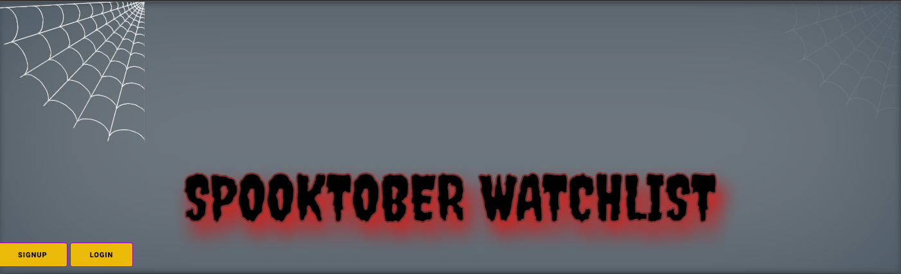
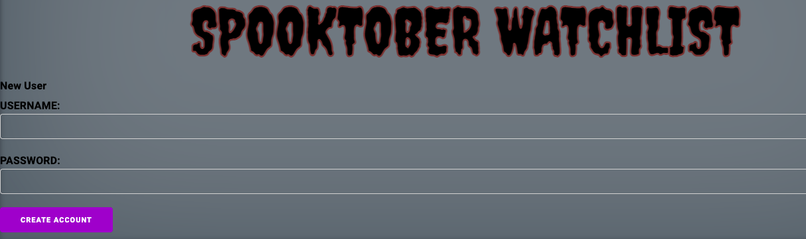
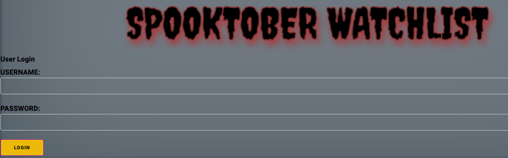
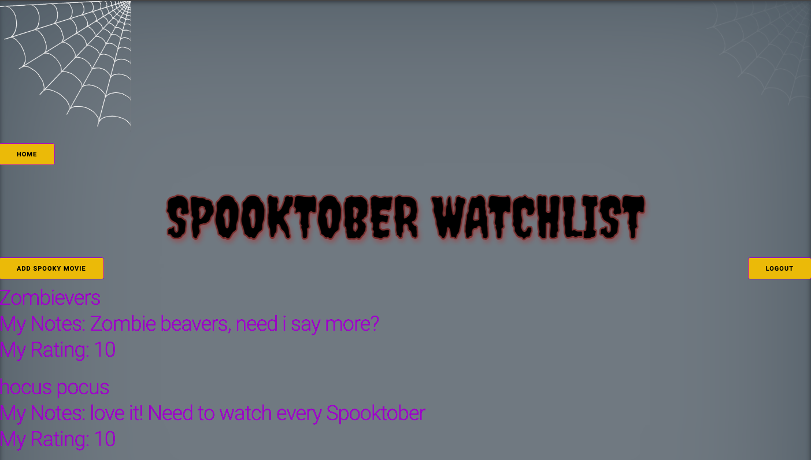
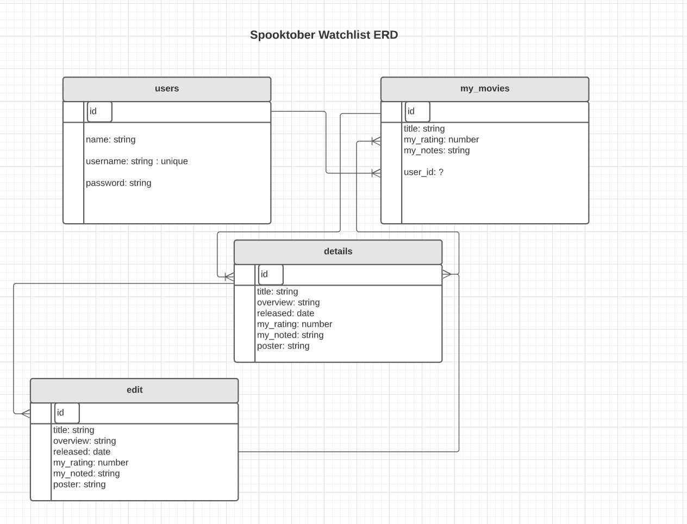
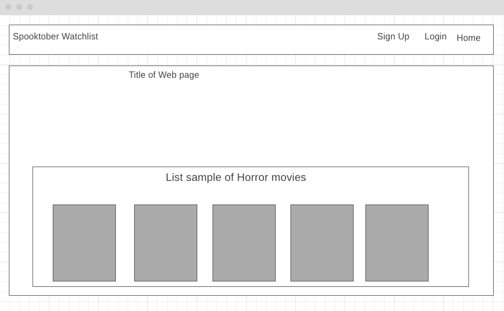
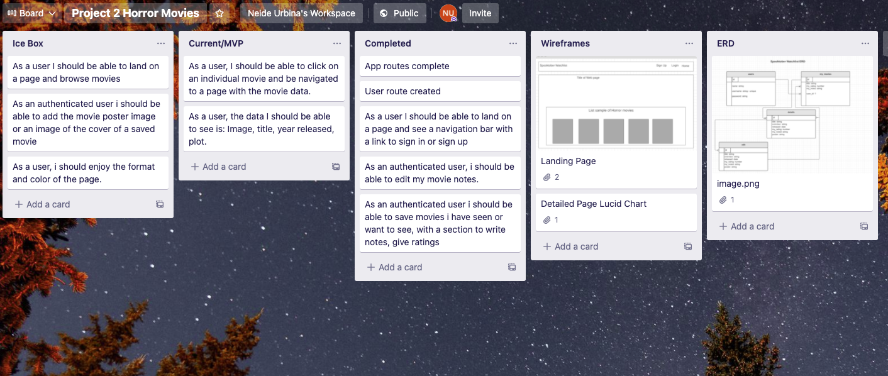
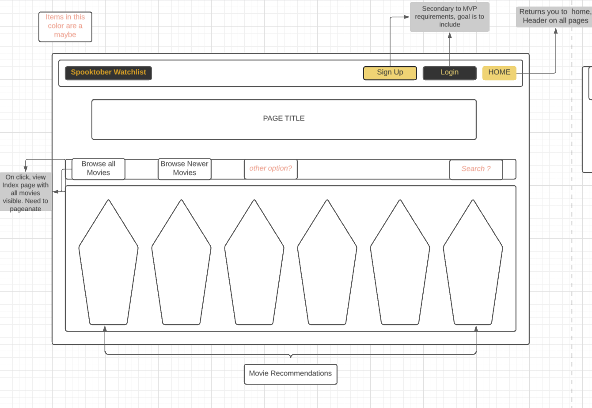

# Ringo-Project2
[Heroku Lab link](https://quacky-project2.herokuapp.com/)

## ** Spooktober Watchlist**
The spooky season is here, time to binge your horrorfest movies. If you are like me, you enjoy watching horror flicks during the month of October especially since most streaming services have more horror options. And if you are like me, you lose track or forget what movies you have seen, which ones you liked, which ones you can go without and which ones have been suggested to you. Spooktober Watchlist will help you keep your spooky movies in order so you do not waste time with the ones you do not like or have already seen. Create your own account and start your spooky list now. 

### **Technologies Used**
        bcryptjs |  connect-mongo  |  dotenv  |  ejs  |  express  |  express-session
        method-override  |  moment  |  mongoose  |  mongoDB  |  heroku  |  HTML5 
        CSS |  javascript

### **App Screenshots**

 ### Lucid Chart - Wire Frame

### Trello

## **Getting Started**
To get started, please visit:
[Spooktober](https://quacky-project2.herokuapp.com/spooktober)

1. Signup - create a username and password
2. Login - Enter your username and password
3. Add Spooky Movie
    Input fields available: Title, Overview, Released (enter MM DD YYYY), Notes, Rating (must be a number), poster (paste a URL for an image from google)
    Add to Watchlist
4. To view your information, click on the existing movie.
5. You can edit the details of the film you are currently viewing. 
6. Delete a movie you no longer want on your list. 
7. Signout

### **Future Enhancements**

The appearance of the landing page will be updated to reflect the following:

I will be linking a Movie Database API so that users without an account can browse through different horror/thriller movies. 
I will be adding a search function and for users with an account, they will be able to add a movie to their watch list. 
The user will be able to add their notes and rating, but the title, overview, release date and poster will be populated by the API. 

I have plans to add more CSS and a nav bar. 